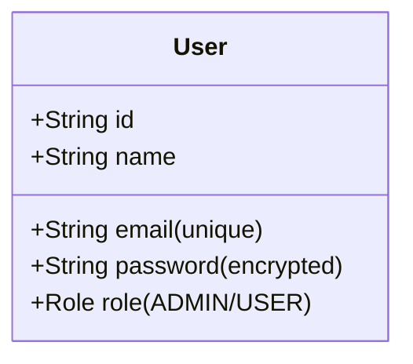
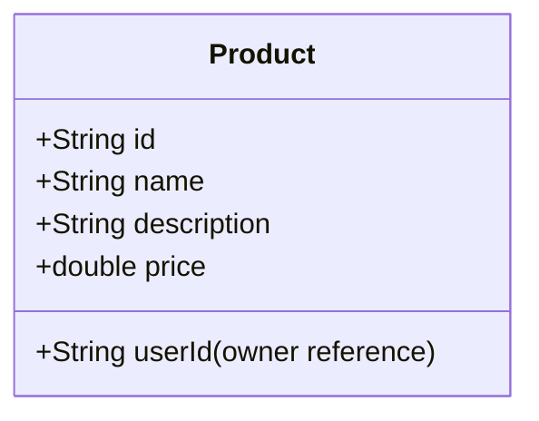
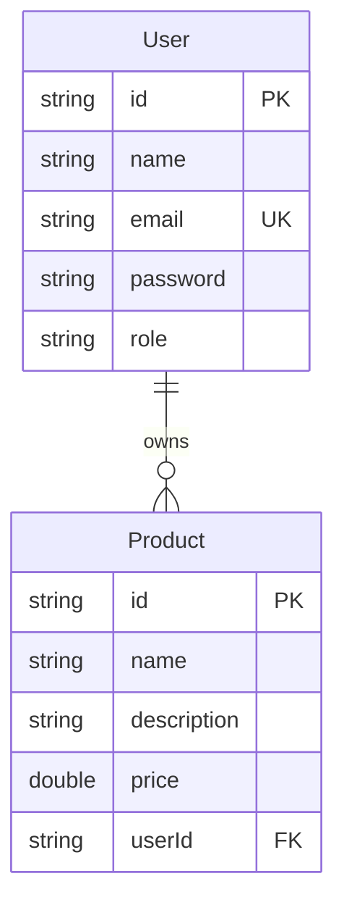

# Spring Boot REST API with MongoDB

A comprehensive CRUD (Create, Read, Update, Delete) RESTful API built with Spring Boot and MongoDB, featuring JWT-based authentication, role-based access control, and advanced security measures. This project serves as a learning resource for building production-ready Spring Boot applications.

## Table of Contents

- [Overview](#overview)
- [Features](#features)
- [Technology Stack](#technology-stack)
- [Database Design](#database-design)
- [Project Structure](#project-structure)
- [API Endpoints](#api-endpoints)
- [Security Implementation](#security-implementation)
- [Prerequisites](#prerequisites)
- [Installation](#installation)
- [Running the Application](#running-the-application)
- [Testing the API](#testing-the-api)
- [Error Handling](#error-handling)
- [Security Measures](#security-measures)
- [Bonus Features](#bonus-features)
- [Learning Objectives](#learning-objectives)

---

## Overview

This Spring Boot application provides a complete backend solution for user and product management. It implements industry-standard security practices, comprehensive error handling, and follows RESTful design principles. The application is designed as a learning project to demonstrate best practices in modern Java backend development.

### Key Capabilities

- **User Management**: Registration, authentication, profile management, and role-based authorization
- **Product Management**: Complete CRUD operations with ownership validation
- **Security**: JWT-based stateless authentication with BCrypt password hashing
- **Error Handling**: Comprehensive exception handling with no 5XX errors for client errors
- **Validation**: Input validation using Jakarta Bean Validation
- **CORS**: Configured Cross-Origin Resource Sharing policies
- **Statistics**: Admin endpoints for user and product analytics

---

## Features

### Core Features

✅ **RESTful API Design** - All endpoints follow REST principles with proper HTTP methods and status codes

✅ **User Management**
- User registration and login
- Profile updates and deletion
- Admin-only user listing and statistics

✅ **Product Management**
- Public product listing (no authentication required)
- Create, read, update, and delete operations
- Ownership-based access control
- Admin statistics

✅ **JWT Authentication**
- Token-based stateless authentication
- 24-hour token expiration
- Secure HMAC-SHA256 signing

✅ **Role-Based Authorization**
- Two roles: `ADMIN` and `USER`
- Role-specific endpoint access
- Resource ownership validation

✅ **Comprehensive Error Handling**
- 20+ exception handlers
- Consistent error response format
- No 5XX errors for client mistakes
- Field-level validation error messages

✅ **Security Measures**
- BCrypt password hashing with salt
- Input validation to prevent injection attacks
- Sensitive data protection (passwords never returned)
- HTTPS-ready configuration

### Bonus Features

✅ **CORS Configuration** - Secure cross-origin policies for frontend integration

✅ **Input Validation** - Extensive validation using Jakarta Bean Validation annotations

✅ **Rate Limiting Protection** - Stateless design prevents session-based attacks

✅ **MongoDB Injection Prevention** - Input sanitization and validation

---

## Technology Stack

| Technology | Version | Purpose |
|------------|---------|---------|
| **Java** | 17 | Programming language |
| **Spring Boot** | 3.5.4 | Application framework |
| **Spring Security** | 3.5.4 | Authentication & authorization |
| **Spring Data MongoDB** | 3.5.4 | Database integration |
| **MongoDB** | Latest | NoSQL database |
| **JJWT** | 0.11.5 | JWT token management |
| **Jakarta Validation** | 3.x | Input validation |
| **Maven** | 3.x | Build tool |
| **Docker** | Latest | Container platform (for MongoDB) |

---

## Database Design

The application uses MongoDB with two main collections:

### User Collection



**Constraints:**
- `email`: Unique index, valid email format required
- `name`: 3-100 characters, letters and spaces only
- `password`: 6-100 characters, BCrypt encrypted
- `role`: Enum (ADMIN or USER)

### Product Collection



**Constraints:**
- `name`: 3-100 characters
- `description`: 5-1000 characters
- `price`: Positive number, max 10,000,000
- `userId`: Reference to User.id

### Relationship



**Relationship:** One User can own multiple Products (1:N)

---

## Project Structure

```
spring-api/
├── src/main/java/com/yelmach/spring_api/
│   ├── config/                          # Configuration classes
│   │   └── SecurityConfig.java          # Security, CORS, JWT configuration
│   │
│   ├── controller/                      # REST endpoints
│   │   ├── AuthController.java          # /api/auth (login, register, me)
│   │   ├── UserController.java          # /api/users (CRUD, stats)
│   │   └── ProductController.java       # /api/products (CRUD, stats)
│   │
│   ├── model/                           # MongoDB entities
│   │   ├── User.java                    # User document
│   │   ├── Product.java                 # Product document
│   │   └── Role.java                    # Role enum (ADMIN, USER)
│   │
│   ├── repository/                      # Data access layer
│   │   ├── UserRepository.java          # User MongoDB operations
│   │   └── ProductRepository.java       # Product MongoDB operations
│   │
│   ├── service/                         # Business logic layer
│   │   ├── AuthService.java             # Authentication logic
│   │   ├── UserService.java             # User business logic
│   │   ├── ProductService.java          # Product business logic
│   │   └── CustomUserDetailsService.java # Spring Security integration
│   │
│   ├── security/                        # JWT & security
│   │   ├── JwtProvider.java             # Token generation & validation
│   │   ├── JwtAuthFilter.java           # JWT authentication filter
│   │   └── AuthEntryPoint.java          # 401/403 error handler
│   │
│   ├── dto/                             # Data Transfer Objects
│   │   ├── request/                     # Request DTOs
│   │   │   ├── LoginRequest.java
│   │   │   ├── RegisterRequest.java
│   │   │   ├── UpdateUserRequest.java
│   │   │   ├── ProductCreationRequest.java
│   │   │   └── ProductUpdateRequest.java
│   │   └── response/                    # Response DTOs
│   │       ├── UserResponse.java        # User data (no password)
│   │       ├── AuthResponse.java        # JWT token + user
│   │       └── ErrorResponse.java       # Error details
│   │
│   ├── exception/                       # Exception handling
│   │   ├── ApiException.java            # Custom exception class
│   │   └── ExceptionHandlerAdvice.java  # Global exception handler (20+ handlers)
│   │
│   └── SpringApiApplication.java        # Application entry point
│
├── src/main/resources/
│   └── application.properties           # App configuration (MongoDB, JWT)
│
├── pom.xml                              # Maven dependencies
├── run.sh                               # Startup script (Docker + Maven)
└── README.md                            # This file
```

**Total:** 28 Java classes organized in 8 packages

---

## API Endpoints

### Authentication (`/api/auth`)

| Endpoint | Method | Access | Description | Request Body | Response |
|----------|--------|--------|-------------|--------------|----------|
| `/api/auth/register` | POST | Public | Register new user | `RegisterRequest` | `AuthResponse` (201) |
| `/api/auth/login` | POST | Public | Login user | `LoginRequest` | `AuthResponse` (200) |
| `/api/auth/me` | GET | Authenticated | Get current user | - | `UserResponse` (200) |

**RegisterRequest:**
```json
{
  "name": "John Doe",
  "email": "john@example.com",
  "password": "securePass123"
}
```

**LoginRequest:**
```json
{
  "email": "john@example.com",
  "password": "securePass123"
}
```

**AuthResponse:**
```json
{
  "token": "eyJhbGciOiJIUzI1NiIsInR5cCI6IkpXVCJ9...",
  "user": {
    "id": "507f1f77bcf86cd799439011",
    "name": "John Doe",
    "email": "john@example.com",
    "role": "USER"
  }
}
```

---

### Users (`/api/users`)

| Endpoint | Method | Access | Description | Response |
|----------|--------|--------|-------------|----------|
| `/api/users` | GET | Admin | Get all users | `List<UserResponse>` (200) |
| `/api/users/{id}` | GET | Admin | Get user by ID | `UserResponse` (200) |
| `/api/users` | PATCH | Authenticated | Update current user | `UserResponse` (200) |
| `/api/users` | DELETE | Authenticated | Delete current user | Success message (200) |
| `/api/users/stats` | GET | Admin | Get user statistics | Stats object (200) |
| `/api/users/{id}` | DELETE | Admin | Delete specific user | Success message (200) |

**UpdateUserRequest** (all fields optional):
```json
{
  "name": "Jane Doe",
  "email": "jane@example.com",
  "password": "newPassword123"
}
```

**User Stats Response:**
```json
{
  "totalUsers": 150,
  "adminCount": 5,
  "userCount": 145
}
```

---

### Products (`/api/products`)

| Endpoint | Method | Access | Description | Response |
|----------|--------|--------|-------------|----------|
| `/api/products` | GET | Public | Get all products | `List<Product>` (200) |
| `/api/products/{id}` | GET | Public | Get product by ID | `Product` (200) |
| `/api/products` | POST | Authenticated | Create product | `Product` (201) |
| `/api/products/me` | GET | Authenticated | Get current user's products | `List<Product>` (200) |
| `/api/products/user/{userId}` | GET | Public | Get products by user ID | `List<Product>` (200) |
| `/api/products/stats` | GET | Admin | Get product statistics | Stats object (200) |
| `/api/products/{id}` | PATCH | Owner/Admin | Update product | `Product` (200) |
| `/api/products/{id}` | DELETE | Owner/Admin | Delete product | Success message (200) |

**ProductCreationRequest:**
```json
{
  "name": "MacBook Pro",
  "description": "Apple M2 Pro chip, 16GB RAM, 512GB SSD",
  "price": 2499.99
}
```

**ProductUpdateRequest** (all fields optional):
```json
{
  "name": "MacBook Pro 2024",
  "description": "Updated description",
  "price": 2399.99
}
```

**Product Response:**
```json
{
  "id": "507f1f77bcf86cd799439012",
  "name": "MacBook Pro",
  "description": "Apple M2 Pro chip, 16GB RAM, 512GB SSD",
  "price": 2499.99,
  "userId": "507f1f77bcf86cd799439011"
}
```

**Product Stats Response:**
```json
{
  "totalProducts": 450,
  "productsByUser": [
    ["507f1f77bcf86cd799439011", 25],
    ["507f1f77bcf86cd799439013", 18],
    ...
  ]
}
```

---

## Security Implementation

### JWT Authentication Flow

1. **User Login/Registration** → Receive JWT token
2. **Subsequent Requests** → Include token in header:
   ```
   Authorization: Bearer <your-jwt-token>
   ```
3. **Server Validates** → Extracts user info and sets authentication context
4. **Access Control** → Checks user role and resource ownership

### JWT Configuration

- **Algorithm**: HMAC-SHA256 (HS256)
- **Expiration**: 24 hours (86400000 ms)
- **Secret**: Configured in `application.properties`
- **Token Structure**: Header.Payload.Signature

### Password Security

- **Hashing**: BCrypt with automatic salt generation
- **Strength**: BCrypt work factor (default 10 rounds)
- **Storage**: Only hashed passwords stored in database
- **Transmission**: Passwords never returned in API responses

### Authorization Rules

| Resource | Action | Access Control |
|----------|--------|----------------|
| User Registration/Login | POST | Public |
| Product Listing | GET | Public |
| Create Product | POST | Authenticated users |
| Update Product | PATCH | Product owner or Admin |
| Delete Product | DELETE | Product owner or Admin |
| Update User Profile | PATCH | User themselves |
| Delete User Account | DELETE | User themselves or Admin |
| View All Users | GET | Admin only |
| User/Product Stats | GET | Admin only |

---

## Prerequisites

Before running this application, ensure you have the following installed:

- **Java 17** or higher
  ```bash
  java -version
  ```

- **Maven 3.x** or use the included Maven wrapper (`./mvnw`)
  ```bash
  mvn -version
  ```

- **Docker** (for MongoDB container)
  ```bash
  docker --version
  ```

- **Docker Daemon** must be running
  ```bash
  docker ps
  ```

---

## Installation

### 1. Clone the Repository

```bash
git clone <repository-url>
cd spring-api
```

### 2. Configure Application Properties

The default configuration in `src/main/resources/application.properties`:

```properties
# MongoDB Configuration
spring.data.mongodb.uri=mongodb://localhost:27017
spring.data.mongodb.database=spring-api

# JWT Configuration
app.jwt.secret=b18a9f9c7d2c35ff0abeb7bf383aac8db1018637ee0b359cfb7654eae4648b33
app.jwt.expiration=86400000
```

**IMPORTANT**: For production, change the JWT secret to a secure, randomly generated value.

### 3. Make the Run Script Executable

```bash
chmod +x run.sh
```

---

## Running the Application

### Option 1: Using the Run Script (Recommended)

The `run.sh` script automatically:
- Checks for Docker installation
- Starts MongoDB container if not running
- Launches the Spring Boot application

```bash
./run.sh
```

### Option 2: Manual Setup

**Step 1**: Start MongoDB using Docker

```bash
docker run -d \
  --name my-mongo \
  -p 27017:27017 \
  mongo
```

**Step 2**: Run the Spring Boot application

```bash
./mvnw spring-boot:run
```

Or with Maven installed:

```bash
mvn spring-boot:run
```

### Verify Application is Running

The application starts on port **8080** by default. You should see:

```
Started SpringApiApplication in X.XXX seconds
```

Access the base URL:
```
http://localhost:8080
```

---

## Testing the API

### Using cURL

**1. Register a new user:**

```bash
curl -X POST http://localhost:8080/api/auth/register \
  -H "Content-Type: application/json" \
  -d '{
    "name": "John Doe",
    "email": "john@example.com",
    "password": "password123"
  }'
```

**Response:**
```json
{
  "token": "eyJhbGciOiJIUzI1NiIsInR5cCI6IkpXVCJ9...",
  "user": {
    "id": "507f1f77bcf86cd799439011",
    "name": "John Doe",
    "email": "john@example.com",
    "role": "USER"
  }
}
```

**2. Login:**

```bash
curl -X POST http://localhost:8080/api/auth/login \
  -H "Content-Type: application/json" \
  -d '{
    "email": "john@example.com",
    "password": "password123"
  }'
```

**3. Get current user (requires authentication):**

```bash
curl -X GET http://localhost:8080/api/auth/me \
  -H "Authorization: Bearer <your-jwt-token>"
```

**4. Create a product:**

```bash
curl -X POST http://localhost:8080/api/products \
  -H "Content-Type: application/json" \
  -H "Authorization: Bearer <your-jwt-token>" \
  -d '{
    "name": "MacBook Pro",
    "description": "Apple M2 Pro chip, 16GB RAM",
    "price": 2499.99
  }'
```

**5. Get all products (no authentication required):**

```bash
curl -X GET http://localhost:8080/api/products
```

**6. Update a product (owner or admin only):**

```bash
curl -X PATCH http://localhost:8080/api/products/{productId} \
  -H "Content-Type: application/json" \
  -H "Authorization: Bearer <your-jwt-token>" \
  -d '{
    "price": 2399.99
  }'
```

**7. Delete a product (owner or admin only):**

```bash
curl -X DELETE http://localhost:8080/api/products/{productId} \
  -H "Authorization: Bearer <your-jwt-token>"
```

### Using Postman

1. Import the following base URL: `http://localhost:8080`
2. Create requests for each endpoint
3. For authenticated endpoints, add `Authorization` header:
   - **Key**: `Authorization`
   - **Value**: `Bearer <your-jwt-token>`

### Using Thunder Client (VS Code)

1. Install Thunder Client extension
2. Create a new collection
3. Add requests with the endpoints listed above

---

## Error Handling

The application implements comprehensive error handling with **20+ exception handlers** covering all common scenarios.

### Error Response Format

All errors follow a consistent structure:

```json
{
  "status": 400,
  "error": "Bad Request",
  "message": "Detailed error message",
  "details": {
    "field1": "Field-specific error",
    "field2": "Another field error"
  }
}
```

### Common Error Codes

| Status | Error | Scenario |
|--------|-------|----------|
| 400 | Bad Request | Invalid input, validation failure |
| 401 | Unauthorized | Missing/invalid JWT token |
| 403 | Forbidden | Insufficient permissions |
| 404 | Not Found | Resource doesn't exist |
| 405 | Method Not Allowed | Wrong HTTP method |
| 409 | Conflict | Duplicate email, unique constraint violation |
| 415 | Unsupported Media Type | Wrong Content-Type |

### Validation Error Example

**Request:**
```json
{
  "name": "Jo",
  "email": "invalid-email",
  "password": "123"
}
```

**Response (400):**
```json
{
  "status": 400,
  "error": "Validation Failed",
  "message": "Please check your input data",
  "details": {
    "name": "Name must be between 3 and 100 characters",
    "email": "Please provide a valid email address",
    "password": "Password must be between 6 and 100 characters"
  }
}
```

### No 5XX Errors Policy

The application is designed to never return 5XX errors for client mistakes:
- Input validation prevents bad data
- Exception handlers catch all runtime errors
- Database errors are translated to 4XX responses
- JWT errors return 401 instead of 500

---

## Security Measures

### 1. Password Hashing

✅ **Implementation**: BCrypt with automatic salt generation

```java
// AuthService.java
passwordEncoder.encode(request.password())
```

- Each password gets a unique salt
- Work factor: 10 rounds (default)
- Resistant to rainbow table attacks

### 2. Input Validation

✅ **Implementation**: Jakarta Bean Validation annotations

**Example from User.java:**
```java
@Pattern(regexp = "^[a-zA-Z\\s]+$", message = "Name can only contain letters and spaces")
private String name;

@Email(message = "Please provide a valid email address")
private String email;
```

**Prevents:**
- SQL/NoSQL injection
- XSS attacks
- Invalid data types
- Out-of-range values

### 3. Sensitive Data Protection

✅ **Implementation**: DTOs without sensitive fields

```java
// UserResponse.java (no password field)
public record UserResponse(
    String id,
    String name,
    String email,
    Role role
) {
    public static UserResponse fromUser(User user) {
        return new UserResponse(
            user.getId(),
            user.getName(),
            user.getEmail(),
            user.getRole()
        );
    }
}
```

**Protects:**
- Passwords never returned in responses
- Internal IDs sanitized
- Sensitive fields excluded from DTOs

### 4. HTTPS Support

✅ **Ready for HTTPS**: Stateless JWT design works seamlessly with TLS

**Production Deployment:**
- Configure SSL certificate in `application.properties`
- Use reverse proxy (Nginx, Apache) for HTTPS termination
- Enable HSTS headers

### 5. CORS Configuration

✅ **Implementation**: Restrictive CORS policy

```java
// SecurityConfig.java
configuration.setAllowedOrigins(List.of("http://localhost:8080"));
configuration.setAllowedMethods(List.of("GET", "POST", "PATCH", "DELETE"));
configuration.setAllowedHeaders(List.of("Authorization", "Content-Type"));
```

### 6. MongoDB Injection Prevention

✅ **Implementation**: Input validation and parameterized queries

- Spring Data MongoDB uses parameterized queries
- Validation prevents malicious input
- No raw query strings constructed from user input

### 7. Rate Limiting

✅ **Design**: Stateless architecture prevents session fixation

**Additional Protection** (can be added):
- Spring Cloud Gateway rate limiting
- Bucket4j rate limiter
- Redis-based request tracking

---

## Bonus Features

### 1. CORS Policies ✅

**Implementation**: SecurityConfig.java:238

```java
@Bean
public CorsConfigurationSource corsConfigurationSource() {
    CorsConfiguration configuration = new CorsConfiguration();
    configuration.setAllowedOrigins(List.of("http://localhost:8080"));
    configuration.setAllowedMethods(List.of("GET", "POST", "PATCH", "DELETE"));
    configuration.setAllowedHeaders(List.of("Authorization", "Content-Type"));
    configuration.setAllowCredentials(true);

    UrlBasedCorsConfigurationSource source = new UrlBasedCorsConfigurationSource();
    source.registerCorsConfiguration("/**", configuration);
    return source;
}
```

**Benefits:**
- Prevents unauthorized cross-origin access
- Allows specific frontend domains
- Restricts HTTP methods and headers

### 2. Comprehensive Input Validation ✅

**Implementation**: Jakarta Bean Validation in all DTOs and entities

**Example:**
```java
@NotBlank(message = "Product name is required")
@Size(min = 3, max = 100, message = "Product name must be between 3 and 100 characters")
private String name;

@Positive(message = "Price must be a positive number")
@DecimalMax(value = "10000000.00", message = "Price cannot exceed 10,000,000")
private Double price;
```

**Prevents:**
- Empty fields
- Out-of-range values
- Invalid formats
- Type mismatches

### 3. MongoDB Injection Prevention ✅

**Implementation**:
- Parameterized queries via Spring Data MongoDB
- Input validation on all user-provided data
- No raw query construction

### 4. Resource Ownership Validation ✅

**Implementation**: ProductService.java

```java
// Only product owner can update
if (!product.getUserId().equals(userId)) {
    throw ApiException.forbidden("You don't have permission to update this product");
}

// Admin can delete any product, users only their own
if (user.role() != Role.ADMIN && !product.getUserId().equals(user.id())) {
    throw ApiException.forbidden("You don't have permission to delete this product");
}
```

### 5. Statistics Endpoints ✅

**User Stats** (`GET /api/users/stats`):
```json
{
  "totalUsers": 150,
  "adminCount": 5,
  "userCount": 145
}
```

**Product Stats** (`GET /api/products/stats`):
```json
{
  "totalProducts": 450,
  "productsByUser": [
    ["user-id-1", 25],
    ["user-id-2", 18]
  ]
}
```

---

## Learning Objectives

This project demonstrates mastery of the following concepts:

### ✅ Completed Objectives

1. **Database Design**
   - MongoDB document modeling
   - One-to-many relationships
   - Unique constraints and indexing

2. **RESTful API Development**
   - Proper HTTP methods (GET, POST, PATCH, DELETE)
   - Resource-based URL design
   - Appropriate status codes (200, 201, 400, 401, 403, 404, 409)
   - Stateless API design

3. **Authentication & Authorization**
   - JWT token generation and validation
   - Token-based stateless authentication
   - Role-based access control (RBAC)
   - Resource ownership validation
   - Spring Security integration

4. **Error Handling**
   - Global exception handler with @RestControllerAdvice
   - 20+ exception handlers covering all scenarios
   - Consistent error response format
   - No 5XX errors for client mistakes
   - Field-level validation errors

5. **Security Measures**
   - BCrypt password hashing with salt
   - Input validation (Jakarta Bean Validation)
   - Sensitive data protection (no passwords in responses)
   - MongoDB injection prevention
   - HTTPS-ready design
   - CORS configuration
   - JWT secret configuration

6. **Bonus Features**
   - CORS policies implemented
   - Rate limiting design (stateless)
   - Comprehensive input validation
   - Resource ownership checks
   - Statistics endpoints

### Architecture Patterns Demonstrated

- **Layered Architecture**: Controller → Service → Repository → Database
- **DTO Pattern**: Separation of API contracts from domain entities
- **Dependency Injection**: Spring's IoC container
- **Exception Translation**: Domain exceptions to HTTP responses
- **Builder Pattern**: Used in JWT creation
- **Factory Pattern**: UserResponse.fromUser()
- **Filter Chain**: JWT authentication filter
- **Stateless Design**: No server-side sessions

---

## Project Statistics

| Metric | Count |
|--------|-------|
| Total Java Classes | 28 |
| API Endpoints | 16 |
| Controllers | 3 |
| Services | 4 |
| Repositories | 2 |
| DTOs | 8 |
| Models/Entities | 3 |
| Security Components | 3 |
| Exception Handlers | 20+ |
| Lines of Code | ~2,500 |

---

## Future Enhancements

Potential improvements for extended learning:

- [ ] **Pagination**: Add pagination to list endpoints
- [ ] **Sorting & Filtering**: Query parameters for product search
- [ ] **Refresh Tokens**: Implement token refresh mechanism
- [ ] **Email Verification**: Send verification emails on registration
- [ ] **Password Reset**: Forgot password functionality
- [ ] **File Upload**: Product images upload
- [ ] **Logging**: Structured logging with SLF4J
- [ ] **Metrics**: Spring Boot Actuator integration
- [ ] **Testing**: Unit and integration tests
- [ ] **API Documentation**: Swagger/OpenAPI specification
- [ ] **Docker Compose**: Multi-container setup
- [ ] **CI/CD**: GitHub Actions or Jenkins pipeline
- [ ] **Caching**: Redis integration for frequently accessed data

---

## Troubleshooting

### Common Issues

**1. MongoDB connection failed**
```
Error: MongoSocketOpenException: Exception opening socket
```
**Solution**: Ensure MongoDB container is running
```bash
docker ps
docker start my-mongo
```

**2. Port 8080 already in use**
```
Error: Web server failed to start. Port 8080 was already in use
```
**Solution**: Change port in `application.properties`
```properties
server.port=8081
```

**3. JWT token expired**
```
{
  "status": 401,
  "error": "Unauthorized",
  "message": "JWT token has expired"
}
```
**Solution**: Login again to get a new token

**4. Permission denied on run.sh**
```
bash: ./run.sh: Permission denied
```
**Solution**: Make script executable
```bash
chmod +x run.sh
```

---

## Contributing

This is a learning project. If you'd like to contribute:

1. Fork the repository
2. Create a feature branch (`git checkout -b feature/amazing-feature`)
3. Commit your changes (`git commit -m 'Add amazing feature'`)
4. Push to the branch (`git push origin feature/amazing-feature`)
5. Open a Pull Request

---

## License

This project is open source and available for learning purposes.

---

## Acknowledgments

- Spring Boot documentation and guides
- MongoDB documentation
- JJWT library for JWT implementation
- Spring Security reference documentation

---

## Contact

For questions or feedback about this learning project, please open an issue in the repository.

---

**Built with ❤️ for learning Spring Boot**
