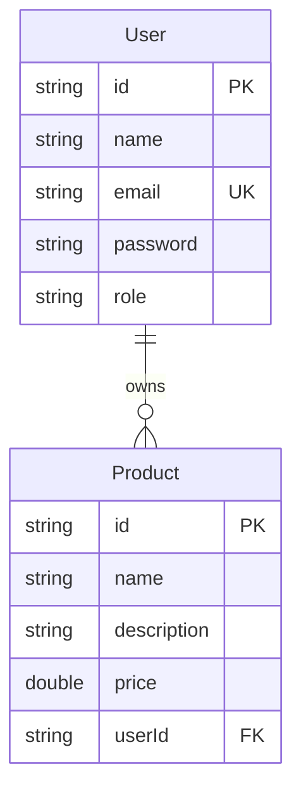

# Spring Boot REST API with MongoDB

A comprehensive CRUD (Create, Read, Update, Delete) RESTful API built with Spring Boot and MongoDB, featuring JWT-based authentication, role-based access control, and advanced security measures. This project serves as a learning resource for building Spring Boot applications.

## Overview

This Spring Boot application provides a backend for user and product management. It implements security practices, comprehensive error handling, and follows RESTful design principles. The application is designed as a learning project to demonstrate best practices in modern spring boot backend development.

### Key Capabilities

- **User Management**: Registration, authentication, profile management, and role-based authorization

- **Product Management**: Complete CRUD operations with ownership validation

- **Security**: JWT-based stateless authentication with BCrypt password hashing

- **Error Handling**: Comprehensive exception handling with proper messages

- **Validation**: Input validation using Jakarta Bean Validation

- **CORS**: Configured Cross-Origin Resource Sharing policies

- **Statistics**: Admin endpoints for user and product analytics

## Features

### Core Features

**RESTful API Design**
- All endpoints follow REST principles with proper HTTP methods and status codes

**User Management**

- User registration and login
- Profile updates and deletion
- Admin-only user listing and statistics

**Product Management**

- Public product listing (no authentication required)
- Create, read, update, and delete operations
- Ownership-based access control
- Admin statistics

**JWT Authentication**

- Token-based stateless authentication
- 24-hour token expiration
- Secure HMAC-SHA256 signing

  **Role-Based Authorization**

- Two roles: `ADMIN` and `USER`
- Role-specific endpoint access
- Resource ownership validation

**Comprehensive Error Handling**

- 20+ exception handlers
- Consistent error response format
- No 5XX errors for client mistakes
- Field-level validation error messages

**Security Measures**

- BCrypt password hashing with salt
- Input validation to prevent injection attacks
- Sensitive data protection (passwords never returned)
- HTTPS-ready configuration
- Secure cross-origin policies for frontend integration

## Technology Stack

| Technology              | Version | Purpose                          |
| ----------------------- | ------- | -------------------------------- |
| **Java**                | 17      | Programming language             |
| **Spring Boot**         | 3.5.4   | Application framework            |
| **Spring Security**     | 3.5.4   | Authentication & authorization   |
| **Spring Data MongoDB** | 3.5.4   | Database integration             |
| **MongoDB**             | Latest  | NoSQL database                   |
| **JJWT**                | 0.11.5  | JWT token management             |
| **Jakarta Validation**  | 3.x     | Input validation                 |
| **Maven**               | 3.x     | Build tool                       |
| **Docker**              | Latest  | Container platform (for MongoDB) |

## Database Design



**Relationship:** One User can own multiple Products (1:N)

## Project Structure

```

spring-api/
├── src/main/java/com/yelmach/spring_api/
│   ├── config/                          # Configuration classes
│   │   └── SecurityConfig.java          # Security, CORS, JWT configuration
│   │
│   ├── controller/                      # REST endpoints
│   │   ├── AuthController.java          # /api/auth (login, register, me)
│   │   ├── UserController.java          # /api/users (CRUD, stats)
│   │   └── ProductController.java       # /api/products (CRUD, stats)
│   │
│   ├── model/                           # MongoDB entities
│   │   ├── User.java                    # User document
│   │   ├── Product.java                 # Product document
│   │   └── Role.java                    # Role enum (ADMIN, USER)
│   |
│   ├── repository/                      # Data access layer
│   │   ├── UserRepository.java          # User MongoDB operations
│   │   └── ProductRepository.java       # Product MongoDB operations
│   │
│   ├── service/                         # Business logic layer
│   │   ├── AuthService.java             # Authentication logic
│   │   ├── UserService.java             # User business logic
│   │   ├── ProductService.java          # Product business logic
│   │   └── CustomUserDetailsService.java # Spring Security integration
│   │
│   ├── security/                        # JWT & security
│   │   ├── JwtProvider.java             # Token generation & validation
│   │   ├── JwtAuthFilter.java           # JWT authentication filter
│   │   └── AuthEntryPoint.java          # 401/403 error handler
│   │
│   ├── dto/                             # Data Transfer Objects
│   │   ├── request/                     # Request DTOs
│   │   │   ├── LoginRequest.java
│   │   │   ├── RegisterRequest.java
│   │   │   ├── UpdateUserRequest.java
│   │   │   ├── ProductCreationRequest.java
│   │   │   └── ProductUpdateRequest.java
│   │   └── response/                    # Response DTOs
│   │       ├── UserResponse.java        # User data (no password)
│   │       ├── AuthResponse.java        # JWT token + user
│   │       └── ErrorResponse.java       # Error details
│   │
│   ├── exception/                       # Exception handling
│   │   ├── ApiException.java            # Custom exception class
│   │   └── ExceptionHandlerAdvice.java  # Global exception handler
│   │
│   └── SpringApiApplication.java        # Application entry point
│
├── src/main/resources/
│   └── application.properties           # App configuration (MongoDB, JWT)
│
├── pom.xml                              # Maven dependencies
├── run.sh                               # Startup script (Docker + Maven)
└── README.md                            # This file

```

## API Endpoints

### Authentication (`/api/auth`)

| Endpoint             | Method | Access        | Description       | Request Body      | Response             |
| -------------------- | ------ | ------------- | ----------------- | ----------------- | -------------------- |
| `/api/auth/register` | POST   | Public        | Register new user | `RegisterRequest` | `AuthResponse` (201) |
| `/api/auth/login`    | POST   | Public        | Login user        | `LoginRequest`    | `AuthResponse` (200) |
| `/api/auth/me`       | GET    | Authenticated | Get current user  | -                 | `UserResponse` (200) |

**RegisterRequest:**

```json
{
  "name": "John Doe",
  "email": "john@example.com",
  "password": "securePass123"
}
```

**LoginRequest:**

```json
{
  "email": "john@example.com",
  "password": "securePass123"
}
```

**AuthResponse:**

```json
{
  "token": "eyJhbGciOiJIUzI1NiIsInR5cCI6IkpXVCJ9...",
  "user": {
    "id": "507f1f77bcf86cd799439011",
    "name": "John Doe",
    "email": "john@example.com",
    "role": "USER"
  }
}
```

---

### Users (`/api/users`)

| Endpoint           | Method | Access        | Description          | Response                   |
| ------------------ | ------ | ------------- | -------------------- | -------------------------- |
| `/api/users`       | GET    | Admin         | Get all users        | `List<UserResponse>` (200) |
| `/api/users/{id}`  | GET    | Admin         | Get user by ID       | `UserResponse` (200)       |
| `/api/users`       | PATCH  | Authenticated | Update current user  | `UserResponse` (200)       |
| `/api/users`       | DELETE | Authenticated | Delete current user  | Success message (200)      |
| `/api/users/stats` | GET    | Admin         | Get user statistics  | Stats object (200)         |
| `/api/users/{id}`  | DELETE | Admin         | Delete specific user | Success message (200)      |

**UpdateUserRequest** (all fields optional):

```json
{
  "name": "Jane Doe",
  "email": "jane@example.com",
  "password": "newPassword123"
}
```

**User Stats Response:**

```json
{
  "totalUsers": 150,
  "adminCount": 5,
  "userCount": 145
}
```

---

### Products (`/api/products`)

| Endpoint                      | Method | Access        | Description                 | Response              |
| ----------------------------- | ------ | ------------- | --------------------------- | --------------------- |
| `/api/products`               | GET    | Public        | Get all products            | `List<Product>` (200) |
| `/api/products/{id}`          | GET    | Public        | Get product by ID           | `Product` (200)       |
| `/api/products`               | POST   | Authenticated | Create product              | `Product` (201)       |
| `/api/products/me`            | GET    | Authenticated | Get current user's products | `List<Product>` (200) |
| `/api/products/user/{userId}` | GET    | Public        | Get products by user ID     | `List<Product>` (200) |
| `/api/products/stats`         | GET    | Admin         | Get product statistics      | Stats object (200)    |
| `/api/products/{id}`          | PATCH  | Owner/Admin   | Update product              | `Product` (200)       |
| `/api/products/{id}`          | DELETE | Owner/Admin   | Delete product              | Success message (200) |

**ProductCreationRequest:**

```json
{
  "name": "MacBook Pro",
  "description": "Apple M2 Pro chip, 16GB RAM, 512GB SSD",
  "price": 2499.99
}
```

**ProductUpdateRequest** (all fields optional):

```json
{
  "name": "MacBook Pro 2024",
  "description": "Updated description",
  "price": 2399.99
}
```

**Product Response:**

```json
{
  "id": "507f1f77bcf86cd799439012",
  "name": "MacBook Pro",
  "description": "Apple M2 Pro chip, 16GB RAM, 512GB SSD",
  "price": 2499.99,
  "userId": "507f1f77bcf86cd799439011"
}
```

**Product Stats Response:**

```json
{
  "totalProducts": 450,
  "productsByUser": [
    ["507f1f77bcf86cd799439011", 25],
    ["507f1f77bcf86cd799439013", 18],
    ...
  ]
}
```

## Security Implementation

### JWT Authentication Flow

1. **User Login/Registration** → Receive JWT token

2. **Subsequent Requests** → Include token in header:

   ```

   Authorization: Bearer <your-jwt-token>

   ```

3. **Server Validates** → Extracts user info and sets authentication context

4. **Access Control** → Checks user role and resource ownership

### JWT Configuration

- **Algorithm**: HMAC-SHA256 (HS256)

- **Expiration**: 24 hours (86400000 ms)

- **Secret**: Configured in `application.properties`

- **Token Structure**: Header.Payload.Signature

### Password Security

- **Hashing**: BCrypt with automatic salt generation

- **Strength**: BCrypt work factor (default 10 rounds)

- **Storage**: Only hashed passwords stored in database

- **Transmission**: Passwords never returned in API responses

### Authorization Rules

| Resource                | Action | Access Control           |
| ----------------------- | ------ | ------------------------ |
| User Registration/Login | POST   | Public                   |
| Product Listing         | GET    | Public                   |
| Create Product          | POST   | Authenticated users      |
| Update Product          | PATCH  | Product owner or Admin   |
| Delete Product          | DELETE | Product owner or Admin   |
| Update User Profile     | PATCH  | User themselves          |
| Delete User Account     | DELETE | User themselves or Admin |
| View All Users          | GET    | Admin only               |
| User/Product Stats      | GET    | Admin only               |

## Prerequisites

Before running this application, ensure you have the following installed:

- **Java 17** or higher

- **Maven 3.x** or use the included Maven wrapper (`./mvnw`)

- **Docker** (for MongoDB container)

- **Docker Daemon** must be running

## Installation

### 1. Clone the Repository

```bash

git clone https://github.com/yelmach/spring-api.git

cd spring-api

```

### 2. Make the Run Script Executable

```bash
chmod +x run.sh
```

### 3. Running the Application

The `run.sh` script automatically:

- Checks for Docker installation
- Starts MongoDB container if not running
- Launches the Spring Boot application

```bash
./run.sh
```

## License

This project is created for educational purposes as part of a full-stack development learning journey.
